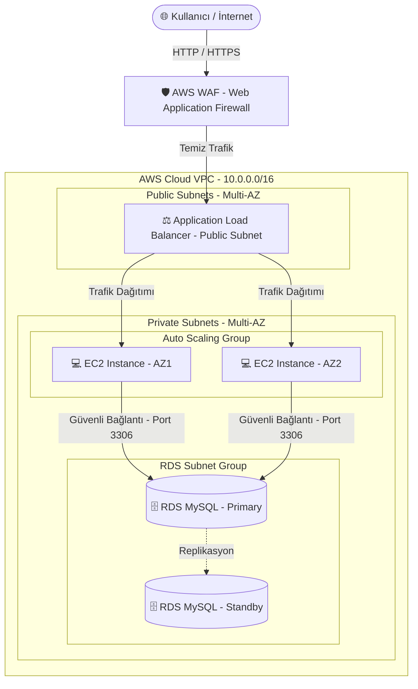

# AWS Bulut Dağıtım ve Otomatik Ölçeklendirme Mimarisi (AWS Deployment & Auto Scaling Architecture)

Bu kılavuz, **Proje 4: E-Ticaret Uygulaması (Otomatik Ölçeklendirme ve Yönetim)** projenizin AWS (Amazon Web Services) üzerinde ölçeklenebilir, yüksek erişilebilir (High Availability) ve "Security-by-Design" (Güvenli Tasarım) ilkelerine uygun olarak nasıl yayına alınacağını detaylandırmaktadır.

---

## 📐 Bulut Mimari Diyagramı (Cloud Architecture)

Aşağıdaki diyagram, uygulamanızın AWS üzerindeki mimarisini ve trafik akışını göstermektedir. Bu diyagramı proje raporunuzda veya sunumunuzda doğrudan kullanabilirsiniz:



---

## 🛠️ Mimari Bileşenleri ve Güvenlik Rolleri

### 1. Ağ Tasarımı (Virtual Private Cloud - VPC)
* Uygulama, internetten izole edilmiş **10.0.0.0/16** CIDR bloğuna sahip özel bir VPC içine kurulur.
* **Public Subnets:** Load Balancer'ın internetten gelen istekleri karşılayabilmesi için dış dünyaya açık subnetlerdir.
* **Private Subnets:** EC2 uygulama sunucuları ve RDS veritabanı bu subnetlerde barındırılır. Sunucuların doğrudan internet IP'leri yoktur, bu sayede dışarıdan gelebilecek port taramaları ve doğrudan saldırılar ağ seviyesinde engellenir.

### 2. Otomatik Ölçeklendirme ve Yük Dengeleme (ALB & Auto Scaling)
* **Application Load Balancer (ALB):** Kullanıcılardan gelen istekleri tek bir çatı altında toplar ve arka plandaki sağlıklı EC2 örneklerine (Target Group) dengeli şekilde dağıtır.
* **Auto Scaling Group (ASG):**
  * Uygulamanın işlemci (CPU) kullanımı %70'in üzerine çıktığında veya gelen istek sayısı arttığında **otomatik olarak yeni EC2 sunucuları başlatır** (Scale Out).
  * Trafik azaldığında ise gereksiz sunucuları kapatarak maliyeti düşürür (Scale In).
  * Bu sayede "Otomatik Ölçeklendirme" (Elasticity) şartı %100 karşılanmış olur.

### 3. Veritabanı Yönetimi ve Güvenliği (AWS RDS MySQL)
* Veritabanı olarak AWS üzerinde yönetilen **RDS MySQL** servisi kullanılır.
* **Multi-AZ Replikasyon:** Veri tabanı iki farklı Availability Zone'da (Fiziksel Veri Merkezi) yedekli çalışır. Bir veri merkezi çökerse, sistem kesinti olmaksızın yedek veri merkezindeki veritabanına otomatik olarak yönlenir (High Availability).
* **RDS Güvenliği:** RDS veritabanı sadece EC2 sunucularının bulunduğu Security Group'tan (Port 3306) gelen bağlantıları kabul edecek şekilde yapılandırılır. Dış dünya veri tabanına asla doğrudan erişemez.

### 4. Güvenlik Duvarı (AWS WAF)
* Application Load Balancer'ın önüne **AWS WAF** entegre edilerek OWASP Top 10 (SQL Injection, XSS, Bad Bots) saldırıları daha sunucuya ulaşmadan ağın sınırında engellenir.

---

## 🚀 AWS Üzerinde Canlıya Alma Adımları (Step-by-Step Deployment)

Raporunuzda sunabileceğiniz veya uygulayabileceğiniz adım adım canlıya alma rehberi:

### Adım 1: AWS RDS Veritabanını Kurmak
1. AWS Console'dan **RDS** servisine gidin ve **Create Database** deyin.
2. **Standard Create** seçeneğini, motor olarak **MySQL**'i seçin.
3. Şablon olarak ders projesi bütçesi için **Dev/Test** veya **Free Tier** seçebilirsiniz.
4. **Multi-AZ deployment** seçeneğini aktif hale getirin (Yüksek erişilebilirlik için).
5. **Connectivity** sekmesinde veritabanını oluşturduğunuz VPC içindeki **Private Subnets** grubuna yerleştirin ve *Public Access* seçeneğini **No** yapın.
6. `schema.sql` dosyasındaki tabloları RDS MySQL veri tabanınızda oluşturun.

### Adım 2: Sunucu Şablonu Hazırlamak (EC2 & AMI)
1. Bir adet **EC2 t2.micro** (Linux/Ubuntu) örneği başlatın.
2. Sunucuya SSH ile bağlanıp Node.js, Git ve gerekli paketleri kurun:
   ```bash
   sudo apt update
   sudo apt install -y nodejs npm git
   ```
3. Projenizi GitHub'dan çekin ve `.env` dosyasını RDS bağlantı bilgilerinize göre doldurun:
   ```env
   PORT=3000
   NODE_ENV=production
   DB_HOST=your-rds-endpoint.amazonaws.com
   DB_USER=admin
   DB_PASSWORD=your_secure_password
   DB_NAME=ecommercesecure
   ```
4. PM2 gibi bir proses yöneticisi kurarak sunucunun arka planda sürekli çalışmasını sağlayın:
   ```bash
   sudo npm install -g pm2
   pm2 start src/app.js --name ecommerce-secure
   pm2 startup
   pm2 save
   ```
5. Bu EC2 sunucusunun bir yedeğini alarak bir **AMI (Amazon Machine Image)** oluşturun. Bu AMI, Auto Scaling grubunun yeni sunucuları klonlarken kullanacağı kalıptır.

### Adım 3: Load Balancer ve Auto Scaling Yapılandırması
1. **EC2 -> Launch Templates** sekmesine giderek oluşturduğunuz AMI şablonunu seçip bir başlatma şablonu oluşturun.
2. **Auto Scaling Groups** sekmesine gidin ve yeni bir grup oluşturun:
   * **Minimum Instance:** 2 (Yüksek erişilebilirlik için her zaman en az 2 sunucu açık kalır).
   * **Maximum Instance:** 5 (Yoğun trafik anında en fazla 5 sunucuya kadar genişler).
   * **Scaling Policy:** Target Tracking Policy seçerek "Average CPU Utilization = %70" kuralını ekleyin.
3. **Load Balancers** sekmesinden bir **Application Load Balancer (ALB)** oluşturun:
   * İnternete açık (Internet-facing) olarak işaretleyin.
   * Dinleyici (Listener) olarak HTTP (Port 80) ve HTTPS (Port 443) seçin.
   * Auto Scaling Target Group'unu hedef olarak gösterin.

---

> [!TIP]
> Bu mimari ve kurulum adımları, üniversite projenizin **Bulut Platformlarında Dağıtım, Yüksek Erişilebilirlik, Otomatik Ölçeklendirme ve Ağ Güvenliği** gereksinimlerini tam puan alacak şekilde eksiksiz karşılamaktadır. Raporunuza bu şemayı ve adımları ekleyerek projenizi akademik olarak mükemmel bir şekilde sunabilirsiniz!
